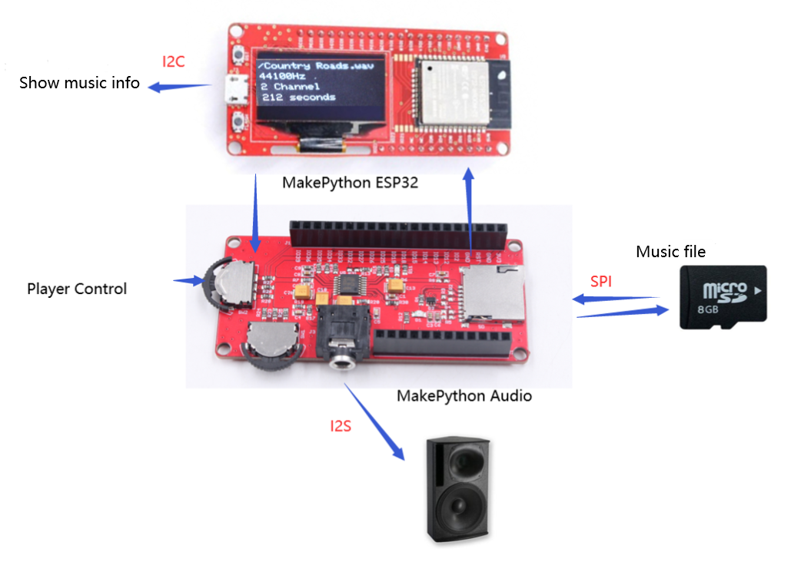
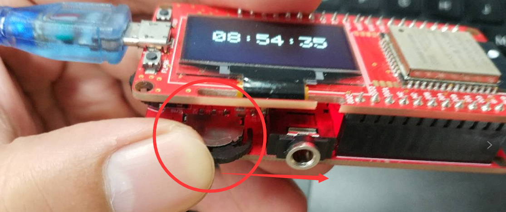
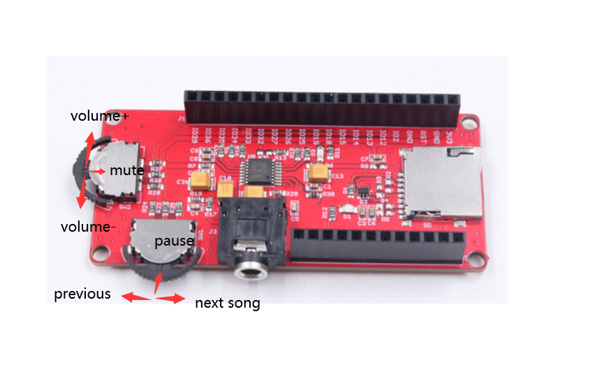
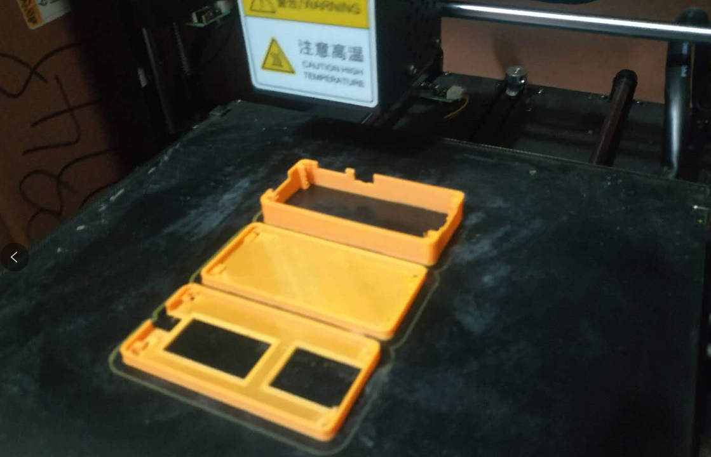
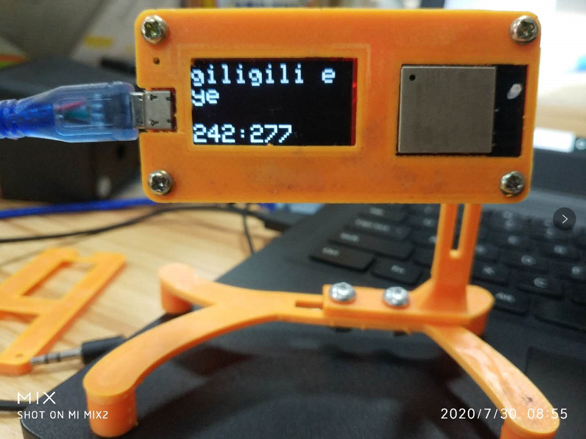

# MicroPython Audio MusicPlayer

```c++
/*
Version:		V2.1
Author:			Vincent
Create Date:	2020/7/8
Update Date:	2020/9/11
Note:
	2020/9/11	V2.1:
	1,Add a bluetooth stero demo.
	2020/7/29	V2.0:
	1,The new version supports all the functions of MP3: song switching, volume adjustment, pause and mute.Support mp3, WAV, ACC common formats.
	2,3D printing shells designed for MakePython ESP32 and MakePython Audio are provided.
	3,The code was completely refacted, and the files of V1.1 were placed in the old-SRc folder. The previous README was renamed to Readme-OldVersion.
	2020/7/18	V1.1: 
	1,Move the original WavPlayer to "\Project_MakePython_Audio_Music\ ESP32_wav_player"
	2,"\Project_MakePython_Audio_Music\ ESP32_MP3" folder for Mp3 decoding instance and volume control instance.
	3,Added a brief description of the MP3 decoder and how to install the library.
	4. MicroPython Audio can be downloaded without unplugging. When uploading the program, please rotate the switch next to the 3.5mm Audio interface to the Audio socket.
*/
```
[YOUTUBE:How to DIY an ESP32 Audio Player(3D print box)](https://youtu.be/uyHbnU4p6tc)

[YOUTUBE:MakePython Audio Music Play](https://www.youtube.com/watch?v=0urJ_uxfW0k&feature=youtu.be)


[toc]

# OVERVIEW

## Intruduce

[Makerfabs home page](https://www.makerfabs.com/)

[Makerfabs Wiki](https://makerfabs.com/wiki/index.php?title=Main_Page)

MakePython Audio inherited the DAC chip and SD card module.The I2S chip allows you to play songs stored on an SD card .The SSD1306 screen displays basic information about the song, and the scroll wheel switch on Audio allows you to switch and pause the music.




## Equipment list

- [MakePython ESP32](https://www.makerfabs.com/wiki/index.php?title=MakePython_ESP32)
- [MakaPython Audio](https://www.makerfabs.com/wiki/index.php?title=MakaPython_Audio)
- Audio/headphones with 3.5mm audio connector
- Micro SD card


# STEPS

## Prepare And Burn

**If you have any questions，such as how to install the development board, how to download the code, how to install the library. Please refer to :[Makerfabs_FAQ](https://github.com/Makerfabs/Makerfabs_FAQ)**

- Install board : esp32 .

- Install library : Adafruit SSD1306 and dependent libraries.
- Install zip library : [ESP32-audioI2S](https://github.com/schreibfaul1/ESP32-audioI2S)("Audio.h")

- Upload file "/Project_MakePython_Audio_Music/music_player.ino"


- **~~ATTENTION !!! Plug ESP32 and Audio expansion boards together after burning. Be sure to plug them together after burning or the firmware will not burn.~~** 
- **V1.1 Add:	MicroPython Audio can be downloaded without unplugging. When uploading the program, please rotate the switch next to the 3.5mm Audio interface to the Audio socket.**



## Prepare Music

- Add some music(.mp3 or .wav) in sdcard.Of course ,name must be English.
- Insert a Micro SD card into MakePython Audio.
- Plug the stereo or earphone into a 3.5mm audio jack.


  

## How to use MusicPlayer

- Power the ESP32 via Micro USB and the LCD screen displays the basic information of the song.
- Such as :The name of the song, the time played, the length of the song.


- Lower side switch, left and right for next song, Previous.Press inward to pause.
- The switch on the left, volume up and down.Press in to mute.




# Esp32-AudioI2S Lib

## Introduce

UDA1334ATS on Makepython Audio does not support MP3 hardware decoding. Here is an example of MP3 decoding and volume control.Not only can you read MP3 files from your SD card, but you can also play MP3 stations directly from the Internet.

## Install Library

Lib from github：[schreibfaul1/ESP32-audioI2S](https://github.com/schreibfaul1/ESP32-audioI2S/)

You can download the library folder "C:\Users\ YourName\Documents\Arduino\ Libraries" installed into the Arduino compiler.Or There is also a copy in the folder "\Project_MakePython_Audio_Music\esp32_mp3\".

## Run Example

- Change the file name of the MP3 in SD card which you want to play.

```c++
//    audio.connecttoFS(SD, "/320k_test.mp3");
      audio.connecttoFS(SD, "/MoonlightBay.mp3");//ChildhoodMemory.mp3  //MoonRiver.mp3
//    audio.connecttoFS(SD, "test.wav");
//    audio.connecttohost("http://www.wdr.de/wdrlive/media/einslive.m3u");
//    audio.connecttohost("http://macslons-irish-pub-radio.com/media.asx");
//    audio.connecttohost("http://mp3.ffh.de/radioffh/hqlivestream.aac"); //  128k aac
//    audio.connecttohost("http://mp3.ffh.de/radioffh/hqlivestream.mp3"); //  128k mp3
//    audio.connecttospeech("Wenn die Hunde schlafen, kann der Wolf gut Schafe stehlen.", "de");
```

- Save and then upload the code to ESP32.
- Plug the SD card into ESP32 and the 3.5mm Audio plug into the Audio interface of MakePython Audio.
- Press RST to restart ESP32 to play music.


# 3D Printer Box

We designed a simple 3D-printed case. Don't need support.





# Old Files

- Because the project use a new audio library, the previous code is no longer applicable.
- All the previous code is in the old-src folder, please refer to readme-oldversion.


# Blue Tooth Stereo

- Install "btAudio" lib from  [tierneytim/btAudio](https://github.com/tierneytim/btAudio)

- Upload "/Project_MakePython_Audio_Music/bluetooth_stereo/bluetooth_stereo.ino".
- Opend your phone and select Bluetooth device "ESP_Speaker"
- Use just like a usual Bluetooth Stereo.