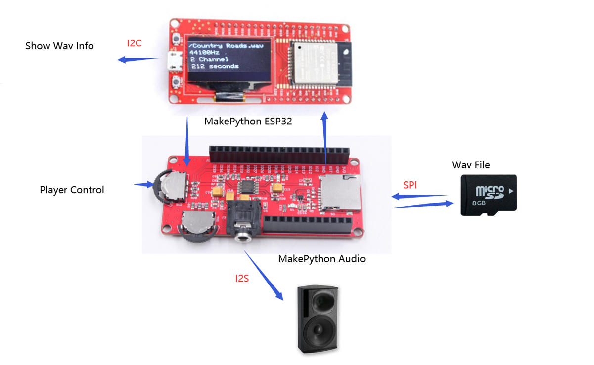
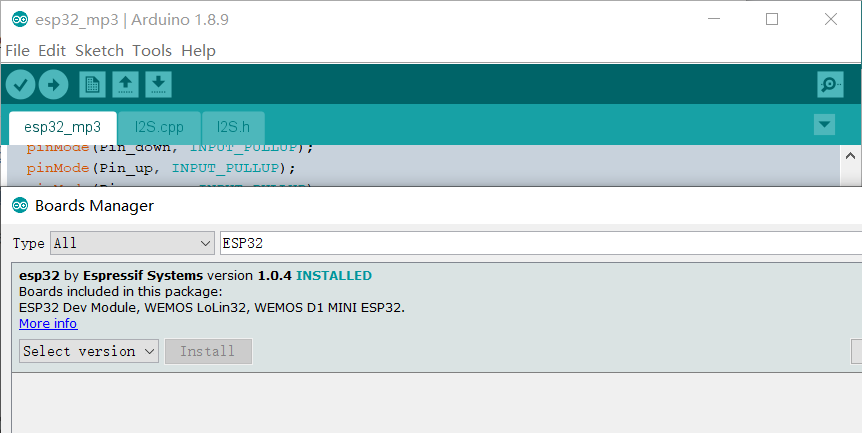
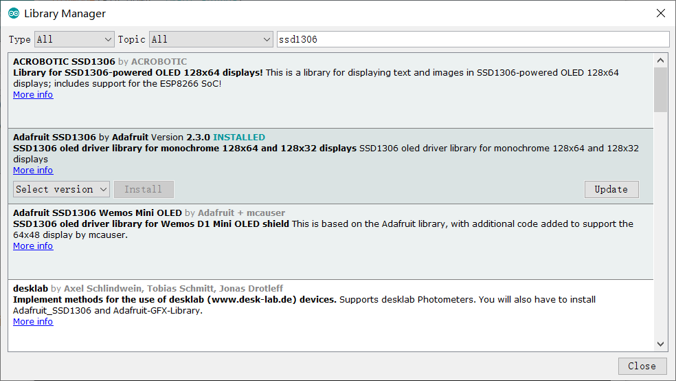
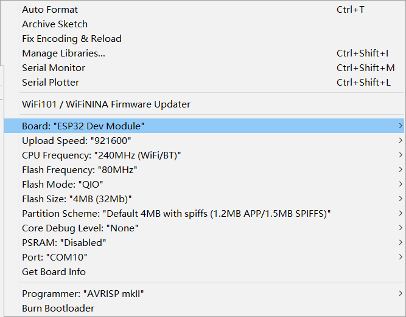
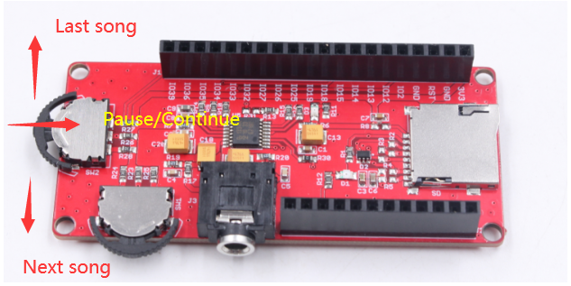

# MicroPython Audio WavPlayer

```c++
/*
Version:		V1.1
Author:			Vincent
Create Date:	2020/7/8
Note:
	2020/7/18	V1.1: 
	1,Move the original WavPlayer to "\Project_MakePython_Audio_Music\ ESP32_wav_player"
	2,"\Project_MakePython_Audio_Music\ ESP32_MP3" folder for Mp3 decoding instance and volume control instance.
	3,Added a brief description of the MP3 decoder and how to install the library.
	4. MicroPython Audio can be downloaded without unplugging. When uploading the program, please rotate the switch next to the 3.5mm Audio interface to the Audio socket.
*/
```


[toc]

# OVERVIEW

## Intruduce

[Makerfabs home page](https://www.makerfabs.com/)

[Makerfabs Wiki](https://makerfabs.com/wiki/index.php?title=Main_Page)

MakePython Audio inherited the DAC chip and SD card module.The I2S chip allows you to play waV songs stored on an SD card without decoding.The SSD1306 screen displays basic information about the song, and the scroll wheel switch on Audio allows you to switch and pause the music.



## Equipment list

- [MakePython ESP32](https://www.makerfabs.com/wiki/index.php?title=MakePython_ESP32)
- [MakaPython Audio](https://www.makerfabs.com/wiki/index.php?title=MakaPython_Audio)
- Audio/headphones with 3.5mm audio connector
- Micro SD card


# STEPS

## Install ESP32 board

- Open arduino ide.
- Select Tools/Board/BoardsManager.
- Search esp32.
- Install esp32 by Espressif Systems.



## Install libraries

- Open arduino ide.
- Select Tools/Manage Libraries.
- Search ssd1306.

- Install Adafruit SSD1306 by Adafruit.

- If youer ardino ide version is old,maybe can't auto install dependent libraries, likes Adafruit_GFX.You may manual install or upgrade arduino ide, such as 1.8.13.




## Burn ESP32

- Open file "/esp32_wav_player/esp32_wav_player.ino"

- Select Toos/board/Esp32 Dev Modue.



- Connect ESP32 to your PC via Micro USB .
- Select Port.
- And at last ,push upload.
- **ATTENTION !!! Plug ESP32 and Audio expansion boards together after burning. Be sure to plug them together after burning or the firmware will not burn.** 
- **V1.1 Add:**	MicroPython Audio can be downloaded without unplugging. When uploading the program, please rotate the switch next to the 3.5mm Audio interface to the Audio socket.


## Prepare Music

- Add some wav music in sdcard.Of course ,name must be English.
- This example program can decode only 44.1khz, 16bit, stereo WAV files.This is a common file format for songs on the Internet.But the I2S chip itself supports waV in all common formats, such as sampling rate of 22.05khz, 16kHz, 24bit, 16bit, mono channel, etc.If you want to play music in other format, please modify the code yourself.
- Insert a Micro SD card into MakePython Audio.
- Plug the stereo or earphone into a 3.5mm audio jack.


  

## How to use WavPlayer

- Power the ESP32 via Micro USB and the LCD screen displays the basic information of the song.


- Use the switch on the left to control the music.Flip up and switch to the previous song.Scroll down and switch to the next song.Press inward to pause/continue the play.



# Arduino Code Explain

```c++
 Wire.begin(MAKEPYTHON_ESP32_SDA, MAKEPYTHON_ESP32_SCL);
  // SSD1306_SWITCHCAPVCC = generate display voltage from 3.3V internally
  if (!display.begin(SSD1306_SWITCHCAPVCC, 0x3C))
  { // Address 0x3C for 128x32
    Serial.println(F("SSD1306 allocation failed"));
    for (;;)
      ; // Don't proceed, loop forever
  }
```

- Set the I2C pin of MakePython ESP32 to drive the LCD.

```c++
SPI.begin(18, 19, 23, 5);
  if (!SD.begin(22, SPI))
  {
    Serial.println("Card Mount Failed");
    return;
  }
```

- Set the SPI pin of MakePython ESP32 to drive the SD card module.
```c++
music_num = get_wav_list(SD, "/", 0, music_list);
```
- Gets a list of WAV files in the SD card.

```c++
music_num = get_wav_list(SD, "/", 0, music_list);
```
- Send audio signals like DAC chips through I2S interface.

```c++
while (file.readBytes(data, sizeof(data)))
{
    I2S_Write(data, sizeof(data));
}
```

# MP3 Decoder

## Introduce

UDA1334ATS on Makepython Audio does not support MP3 hardware decoding. Here is an example of MP3 decoding and volume control.Not only can you read MP3 files from your SD card, but you can also play MP3 stations directly from the Internet.

## Install Library

Lib from github：[schreibfaul1/ESP32-audioI2S](https://github.com/schreibfaul1/ESP32-audioI2S/)

You can download the library folder "C:\Users\ YourName\Documents\Arduino\ Libraries" installed into the Arduino compiler.Or There is also a copy in the folder "\Project_MakePython_Audio_Music\esp32_mp3\".

## Run Example

- Change the file name of the MP3 in SD card which you want to play.

```c++
//    audio.connecttoFS(SD, "/320k_test.mp3");
      audio.connecttoFS(SD, "/MoonlightBay.mp3");//ChildhoodMemory.mp3  //MoonRiver.mp3
//    audio.connecttoFS(SD, "test.wav");
//    audio.connecttohost("http://www.wdr.de/wdrlive/media/einslive.m3u");
//    audio.connecttohost("http://macslons-irish-pub-radio.com/media.asx");
//    audio.connecttohost("http://mp3.ffh.de/radioffh/hqlivestream.aac"); //  128k aac
//    audio.connecttohost("http://mp3.ffh.de/radioffh/hqlivestream.mp3"); //  128k mp3
//    audio.connecttospeech("Wenn die Hunde schlafen, kann der Wolf gut Schafe stehlen.", "de");
```

- Save and then upload the code to ESP32.
- Plug the SD card into ESP32 and the 3.5mm Audio plug into the Audio interface of MakePython Audio.
- Press RST to restart ESP32 to play music.


# Other Files

- Folder："/esp32_sdteset"，"/esp32_ssd1306test"，"/esp32_i2stest".They're all testing demos.
- Code in "/workSpace" is a python demo.But playing 44.1khz, 16bit, stereo WAV has noise, the rest of the format can play, you can try.